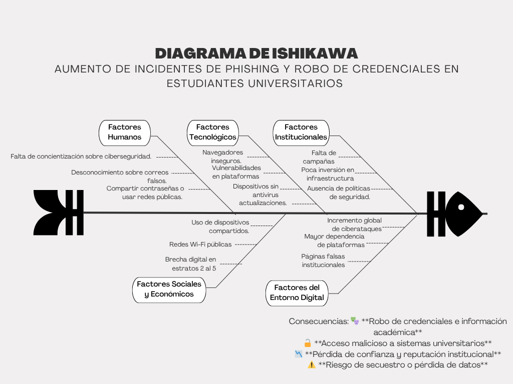

## Análisis de Causas: Diagrama de Ishikawa

### Problema Central
**Aumento de incidentes de phishing y robo de credenciales en estudiantes universitarios**

### Categorías y Causas

**1. Factores Humanos**
* Falta de concientización sobre ciberseguridad.
* Desconocimiento sobre correos falsos.
* Compartir contraseñas o usar redes públicas.

**2. Factores Tecnológicos**
* Navegadores inseguros.
* Vulnerabilidades en plataformas.
* Dispositivos sin antivirus o actualizaciones.

**3. Factores Institucionales**
* Falta de campañas.
* Poca inversión en infraestructura.
* Ausencia de políticas de seguridad.

**4. Factores Sociales y Económicos**
* Uso de dispositivos compartidos.
* Redes Wi-Fi públicas.
* Brecha digital en estratos 2 al 5.

**5. Factores del Entorno Digital**
* Incremento global de ciberataques.
* Mayor dependencia de plataformas.
* Páginas falsas institucionales.

### Consecuencias
* 🎭 **Robo de credenciales e información académica**
* 🔓 **Acceso malicioso a sistemas universitarios**
* 📉 **Pérdida de confianza y reputación institucional**
* ⚠️ **Riesgo de secuestro o pérdida de datos**
